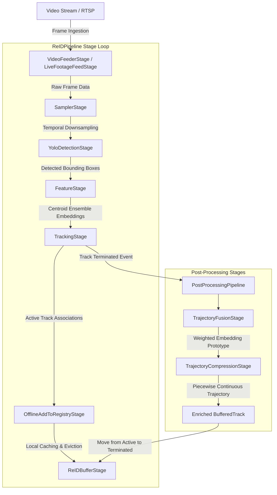

# ReID System Architecture

This document provides a detailed overview of the design, execution pipeline, and components of the Person and Vehicle Re-Identification (**ReID**) package located under [reid/](./reid/).

The ReID package is structured as a frame-by-frame modular processing pipeline. Each video stream runs its own pipeline, which is coordinated sequentially, caching tracks in memory, extracting deep features, and performing post-processing upon track termination.

---

## Architecture Flow

---

## 1. Pipeline Coordination & State Control

### [ReIDPipeline](./reid/pipeline.py#L11)
The execution coordinator that manages the lifecycle of a single video stream processing run.
* **Orchestration**: Runs a frame-by-frame loop passing a single transient state payload through a list of stages sequentially.
* **Key Methods**:
  * `initialize(listener)`: Sequentially configures resources (like loading model weights) for all registered stages.
  * `run(listener)`: Orchestrates the main stream decoding, tracking, and stage execution loop.
  * `finalize()`: Performs teardown and cleanup on pipeline termination.

### [FrameData](./reid/utils.py#L13)
The data transfer object (DTO) propagating downstream through each pipeline stage. It holds the frame frame-rate metadata, raw pixel buffers, intermediate bounding boxes, classification labels, tracked targets, and extracted appearance feature vectors.

---

## 2. Pipeline Stages ([reid/stages/](./reid/stages/))

Each stage inherits from the [PipelineStage](./reid/stages/base.py#L6) base class:

* **[VideoFeederStage](./reid/stages/video_feeder.py#L8) / [LiveFootageFeedStage](./reid/stages/live_feeder.py#L6)**: Handles decoding of video sources (files or RTSP live streams) into raw BGR frames.
* **[SamplerStage](./reid/stages/sampler.py#L7)**: Performs temporal frame downsampling. Supports count-based intervals (for offline video speedup) and wall-clock time intervals (for real-time streaming).
* **[YoloDetectionStage](./reid/stages/detection.py#L7)**: Ingests the frame and performs class-specific detection using YOLOv8. It filters targets according to target categories (person, car, motorcycle, bus, truck).
* **[FeatureStage](./reid/stages/feature_production.py#L11)**: Generates high-dimensional ReID appearance features. Crops bounding boxes, pre-processes them, and runs batch extraction on the ensembled models.
* **[TrackingStage](./reid/stages/tracking.py#L8)**: Performs state association using a chosen backend tracker (e.g. ByteTrack). On track termination, it triggers the callback `on_track_terminated` to fire the post-processing pipeline.
* **[OfflineAddToRegistryStage](./reid/stages/offline_registry.py#L8)**: Logs active track occurrences (frames, bounding boxes, raw embeddings) to the session registry.
* **[ReIDBufferStage](./reid/stages/buffer.py#L40)**: Manages an in-memory cache of both active and terminated tracks. Keeps tracks for a customizable `retention_seconds` window to allow query operations such as intra-camera re-identification search.

---

## 3. ReID Model Ensemble ([reid/inference/](./reid/inference/))

To obtain robust, identity-preserving feature representations, the system executes an ensemble model with centroid fusion:

* **[EnsembleModel](./reid/inference/model/ensemble_model.py#L6)**: A unified `nn.Module` wrapping three deep backbones loaded from distinct check-points:
  1. `resnet101_ibn_a` (Model checkpoint 1)
  2. `resnet101_ibn_a` (Model checkpoint 2)
  3. `resnext101_ibn_a` (Model checkpoint 3)
* **Test-Time Augmentation (TTA)**: If enabled, it forwards both the original and horizontally flipped crops, summing their intermediate feature representations.
* **Centroid Fusion**: For each crop, embeddings are extracted from all three submodels, L2-normalized individually, averaged to produce the mean centroid representation, and L2-normalized again to generate a final unit-length feature vector.
* **[EnsembleReID](./reid/inference/extractor.py#L12)**: The production-grade inference wrapper. It performs image pre-processing (resize to 256x256, mean/standard deviation scaling) and manages FP16 half-precision batch forward passes.

---

## 4. Track Post-Processing ([reid/postprocessing/](./reid/postprocessing/))

When an active target is terminated or lost, the track history and gathered raw frame embeddings are sent through the [PostProcessingPipeline](./reid/postprocessing/pipeline.py#L56):

* **[TrajectoryFusionStage](./reid/postprocessing/stages/trajectory_fusion.py#L94)**: Fuses the timeline of raw frame-level embeddings of the terminated track into a single representative embedding vector.
  * **Mean Fusion**: Computes the simple mean of the temporal vectors and L2-normalizes the result.
  * **Self-Attention Fusion**: Applies scaled dot-product self-attention across all frames of the track, allowing highly discriminative, clear views of the target to attend more strongly and weight the final prototype.
* **[TrajectoryCompressionStage](./reid/postprocessing/stages/trajectory_compression.py#L8)**: Compresses the discrete bounding boxes and frames of the track trajectory using a piecewise trajectory model. The resulting continuous representation is stored as a [CompressedTrack](./tracking/domain/track.py#L114) domain model.

---

## 5. Result Storage & Registry

* **[SimpleRegistry](./reid/registry.py#L5)**: Stores raw frame embeddings and the serialized compressed track representations. Used for generating JSON reports and exporting the final identity embeddings into `.npz` binary arrays.
