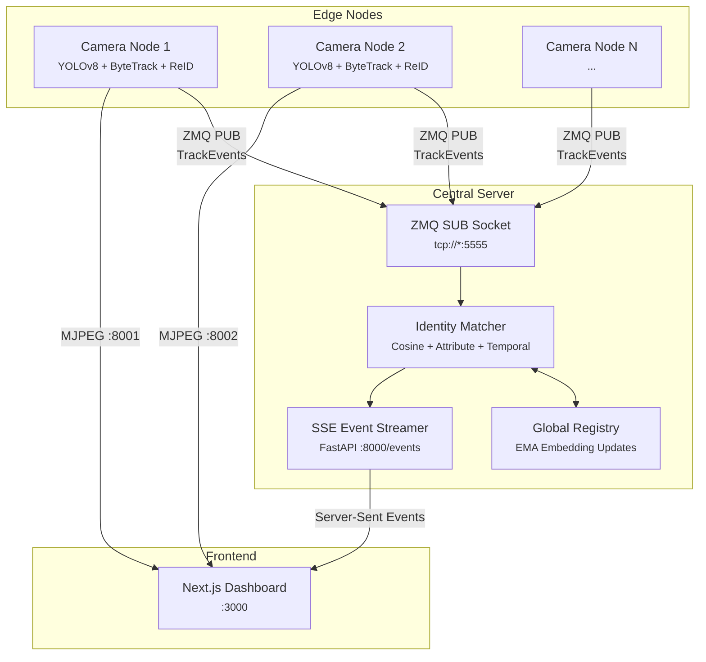
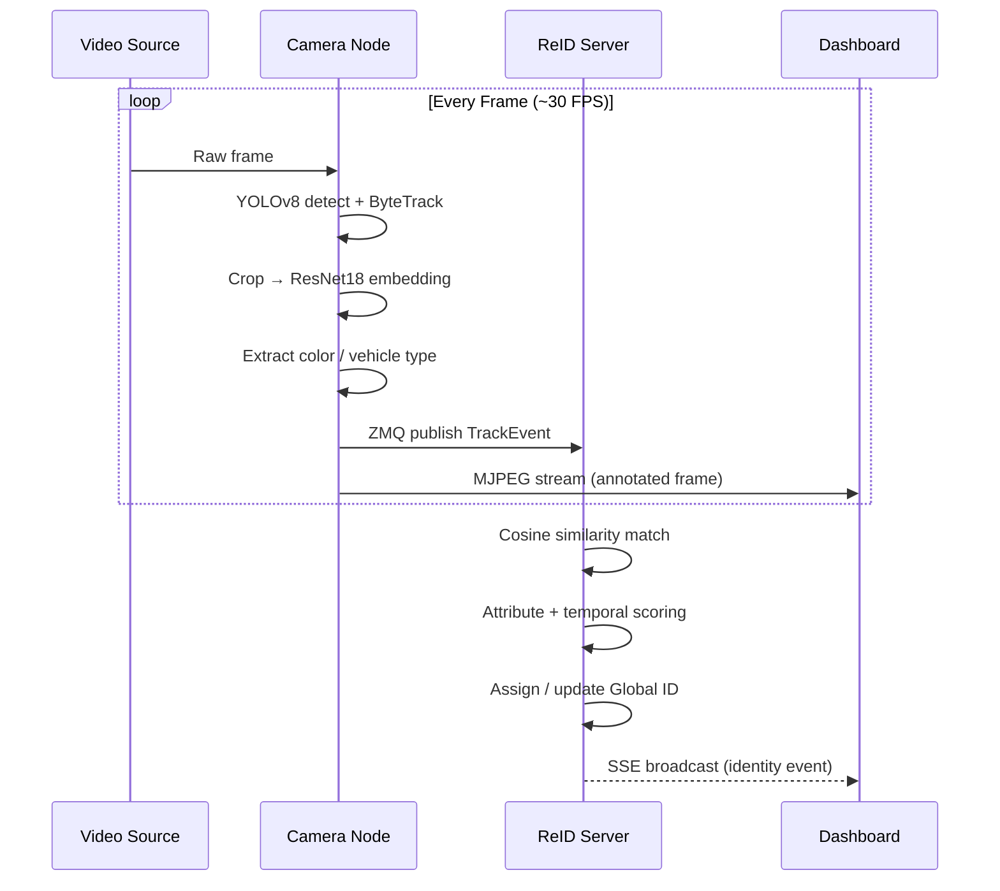

# Distributed Multi-Camera Tracking & Analytics

A real-time, distributed CCTV analytics system that performs **multi-target multi-camera (MTMC) tracking** with cross-camera re-identification. Each camera runs its own edge-node for detection and tracking, while a central server resolves identities across all feeds and streams live results to a web dashboard.

## Architecture



### Data Flow



## Components

| Component | Role | Stack |
|-----------|------|-------|
| **Camera Node** | Per-camera detection, tracking, feature extraction | YOLOv8s, ByteTrack, ResNet18, OpenCV |
| **ReID Server** | Cross-camera identity resolution | ZMQ SUB, cosine + attribute + temporal matching |
| **Dashboard** | Real-time visualization of feeds & identities | Next.js 14, Tailwind, Framer Motion |

### Camera Node Pipeline

Each camera node runs a self-contained pipeline:

1. **Detection** — YOLOv8s detects persons and vehicles (COCO classes 0, 2, 3, 5, 7)
2. **Tracking** — ByteTrack assigns per-camera track IDs across frames
3. **Re-ID Embedding** — ResNet18 (ImageNet) extracts a 512-dim L2-normalized feature vector from each crop
4. **Attribute Extraction** — HSV-based dominant color detection + COCO class → vehicle type mapping
5. **Publish** — Serialized `TrackEvent` sent via ZMQ PUB to the central server
6. **Stream** — Annotated frame served as MJPEG at `/mjpeg`

### ReID Server Matching

The server fuses three signals to resolve identities:

```
score = 0.6 × cosine_sim(embedding) + 0.2 × attribute_match + 0.2 × temporal_proximity
```

- **Match threshold**: 0.70 — below this, a new global identity is created
- **Temporal window**: 300s — identities decay over time
- **Embedding update**: Exponential moving average (α=0.9) on match

## Prerequisites

- **Python 3.9+** and [uv](https://docs.astral.sh/uv/) package manager
- **Node.js 18+** and npm (for the dashboard)
- A webcam or video file(s) to use as camera feeds

## Quick Start

### 1. Clone and install

```bash
git clone https://github.com/arjunmnath/cctv.git
cd cctv
uv sync
```

### 2. Install dashboard dependencies

```bash
cd dashboard
npm install
cd ..
```

### 3. Run with video files

You can use any video files as simulated camera feeds. Each video acts as one camera:

```bash
# Two cameras from local video files
uv run python run_all.py \
  --videos path/to/video1.mp4 path/to/video2.mp4
```

### 4. Run with webcam

Pass the device index (e.g., `0` for default webcam) as a video source:

```bash
# Single webcam
uv run python run_all.py --videos 0
```

### 5. Start the dashboard

In a separate terminal:

```bash
cd dashboard
npm run dev
```

Open **http://localhost:3000** to view:
- Live MJPEG feeds from each camera (ports `8001`, `8002`, ...)
- Real-time identity tracking events via SSE

### One-liner (video files + dashboard)

If you want everything in one command, use the dry run script with your own videos:

```bash
# Edit dry_run.sh to point --videos at your own files, then:
bash dry_run.sh
```

## Docker

Run the full stack in containers. Mount your video files into the camera containers:

```bash
docker compose up --build
```

> **Note:** Edit `docker-compose.yml` to point camera service `command` args at your own video paths (mounted via `volumes`).

```yaml
# Example: mount your local videos
camera-1:
  volumes:
    - /path/to/your/videos:/app/videos:ro
  command: ["--camera_id", "cam_1", "--video_source", "/app/videos/feed1.mp4", ...]
```

## Project Structure

```
cctv/
├── camera_node/          # Edge node (one per camera)
│   ├── main.py           # Frame loop + pipeline orchestration
│   ├── tracker.py        # YOLOv8 + ByteTrack wrapper
│   ├── reid.py           # ResNet18 feature extractor
│   ├── attributes.py     # Color / vehicle-type extraction
│   ├── publisher.py      # ZMQ PUB client
│   ├── streamer.py       # MJPEG FastAPI server
│   └── config.py
├── reid_server/          # Central identity resolver
│   ├── main.py           # Event loop
│   ├── matcher.py        # Multi-signal matching
│   ├── global_registry.py# Identity store + EMA updates
│   ├── subscriber.py     # ZMQ SUB listener
│   ├── event_store.py    # ChromaDB persistence
│   ├── api.py            # SSE event streamer
│   └── config.py
├── shared/               # Common schemas + utilities
│   ├── schemas.py        # TrackEvent, Attributes, Query models
│   └── utils.py          # Logging, cosine sim, attribute sim
├── dashboard/            # Next.js real-time UI
├── run_all.py            # Multi-process launcher
├── dry_run.sh            # One-command demo script
├── Dockerfile.camera     # Camera node image (CPU)
├── Dockerfile.camera.gpu # Camera node image (NVIDIA GPU)
├── Dockerfile.server     # ReID server image
└── docker-compose.yml
```

## Configuration

### Camera Node

| Parameter | Default | Description |
|-----------|---------|-------------|
| `--camera_id` | `cam_1` | Unique camera identifier |
| `--video_source` | `0` | Video file path or webcam index |
| `--zmq_endpoint` | `tcp://127.0.0.1:5555` | ReID server ZMQ address |
| `--api_port` | `8001` | MJPEG stream port |

### ReID Server

| Parameter | Default | Description |
|-----------|---------|-------------|
| `--zmq_bind` | `tcp://*:5555` | ZMQ bind address |
| `--api_port` | `8000` | SSE event stream port |

### Ports

| Service | Port | Protocol |
|---------|------|----------|
| ReID Server (ZMQ) | 5555 | TCP (ZMQ PUB/SUB) |
| ReID Server (SSE) | 8000 | HTTP (`/events`) |
| Camera 1 (MJPEG) | 8001 | HTTP (`/mjpeg`) |
| Camera 2 (MJPEG) | 8002 | HTTP (`/mjpeg`) |
| Dashboard | 3000 | HTTP |

## License

MIT
